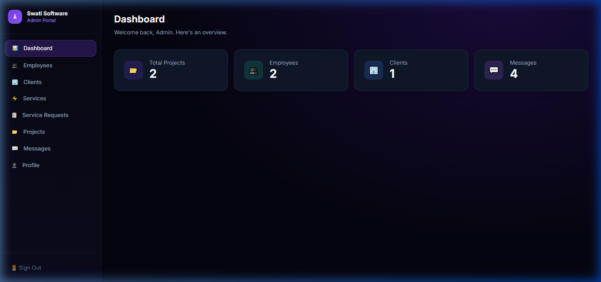
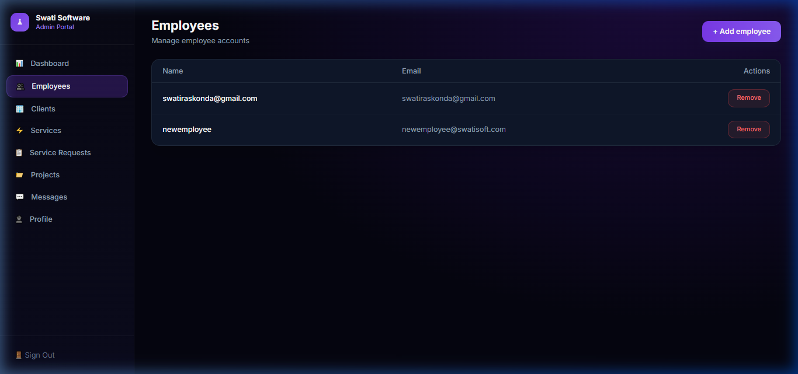

# Swati Software Solutions - Company Management Portal

A robust, role-based company management portal featuring dedicated dashboards for Admins, Employees, and Clients. This platform streamlines project management, service requests, and internal communication.

## 🚀 Features

- **Admin Portal**: Full oversight of users (clients & employees), service management, request approval, and project assignment.
- **Employee Portal**: Dedicated view for assigned projects with status update capabilities and internal messaging.
- **Client Portal**: Interface for browsing services, submitting project requests, and tracking ongoing project progress.
- **Messaging System**: Real-time communication between different user roles.
- **Responsive Design**: Modern, glassmorphic UI built with Tailwind CSS.

## 🛠 Tech Stack

- **Frontend**: React.js, React Router, Tailwind CSS, Lucide Icons, React-Toastify.
- **Backend**: Node.js, Express.js.
- **Database**: MongoDB (Mongoose ORM).
- **Authentication**: Cookie-based JWT authentication with role-based access control (RBAC).
- **Communication**: REST API.

## 📷 Screenshots

### Admin Dashboard


### Employee Management


## ⚙️ Setup Instructions

### Prerequisites
- Node.js (v16+)
- MongoDB (local or Atlas)

### 1. Database Setup
1. Create a MongoDB database (e.g., `company_portal`).
2. Obtain your MongoDB Connection URI.

### 2. Backend Setup
```bash
cd server
npm install
```
Create a `.env` file in the `server` directory:
```env
PORT=5000
MONGO_URI=your_mongodb_uri
JWT_SECRET=your_super_secret_key
CLIENT_URL=http://localhost:3000
```
Seed the initial admin user:
```bash
npm run seed
```

### 3. Frontend Setup
```bash
cd client
npm install
```
Create a `.env` file in the `client` directory:
```env
REACT_APP_API_URL=http://localhost:5000/api
```

### 4. Running the Application
**Start Backend:**
```bash
cd server
npm run dev
```
**Start Frontend:**
```bash
cd client
npm start
```

## 🔑 Test Login Credentials

| Role | Email | Password |
| :--- | :--- | :--- |
| **Admin** | `admin@swatisoft.com` | `admin123` |
| **Employee** | `newemployee@swatisoft.com` | `admin123` |
| **Client** | `ramesh@gmail.com` | `admin123` |

## 📁 Folder Structure

### Frontend (`/client`)
- `/src/pages/admin/` - Admin dashboard and management views.
- `/src/pages/client/` - Client-facing project and service views.
- `/src/pages/employee/` - Employee task management.
- `/src/components/` - Reusable components (Messaging, ImageUpload, etc.).
- `/src/utils/` - API utilities and shared helpers.

### Backend (`/server`)
- `/src/routes/admin/` - Namespaced routes for admin operations.
- `/src/routes/client/` - Namespaced routes for client features.
- `/src/routes/employee/` - Namespaced routes for employee tasks.
- `/src/models/` - Mongoose schemas (User, Project, Service, etc.).
- `/src/middleware/` - Auth and role-based validation.

---
Developed for **Swati Software Solutions**.

## 🚀 Deployment (Render)

This project is configured for automated deployment to **Render** via GitHub Actions.

### 1. Render Setup
1. Log in to [Render](https://render.com).
2. Click **New +** > **Blueprint**.
3. Connect your GitHub repository.
4. Render will automatically detect `render.yaml` and create a single **swatis-company-portal** service that serves both the frontend and backend.

### 2. Configure Environment Variables on Render
#### Full Stack App (`swatis-company-portal`)
- `MONGO_URI`: Your MongoDB Atlas connection string.
- `JWT_SECRET`: A long random string for token security.
- `CLIENT_URLS`: `https://swatis-company-portal.onrender.com` (or empty if same domain).

*Note: The frontend is built automatically and served by the Express backend.*

### 3. GitHub Actions (Auto-Deploy)
To enable automatic deployment on push:
1. In Render, go to your service's **Settings** and find the **Deploy Hook** URL.
2. In your GitHub repository, go to **Settings > Secrets and variables > Actions**.
3. Add the following secret:
   - `RENDER_DEPLOY_HOOK_BACKEND`: The hook URL for the service.

Now, every push to the `main` branch will trigger a deployment!
